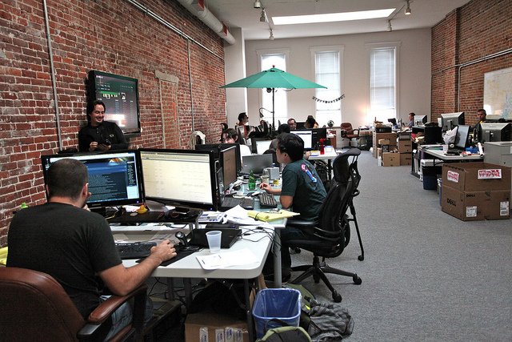

How to refactor, experiment, and innovate on a deadline.
========================================================

About Me
----------

Consultant. Founder of I.TV and Orbital Labs. I help clients create quality products quickly.

* [@seanhess](http://twitter.com/seanhess)
* [http://seanhess.github.io](http://seanhess.github.io)
* [http://linkedin.com/in/seanhess](http://linkedin.com/in/seanhess)

My expertise:

* Create and ship products
* Explore ideas and prototype
* Mentor and train teams in new technologies
* Advisory board

Introduction
------------

Companies want to be innovative, but it's up to everyone to make it happen.

- training / learning
- exploring / trying new things
- refactoring
- paying down technical debt
- coming up with new ideas
- creativity
- exploring

What do these have in common?
-----------------------------

- they provide long-term benefits with short-term costs
- indirectly related to your goals

A different kind of work. It takes more time. Exploration. Curiosity. Where does it lead? 

Let's call this "Exploration"

Why do humans explore?
----------------------

Why exploration in a tech company?
--------------------------------

What's the opposite of innovation, learning, exploring ?

Technical Debt

Why is technical debt bad?
--------------------------

Eventually your product owns you, your time, and your creative output. Loss of freedom to create.

Let's talk about Finances
-------------------------

Debt results in a loss of freedom.

Savings result in a gain of freedom.

Debt ------- 0 ------- Savings

Paying off debts = Investing in the future

Financial Independence
----------------------

[My Money Mustache](http://www.mrmoneymustache.com/2012/01/13/the-shockingly-simple-math-behind-early-retirement/). Financial freedom

"I wish I could do that..." Invest!

Technical Debt
--------------

What is it like to be in debt?

- That feature is going to take 2 months, because we have to rejigger the whatzits.
- Every time I change anything, something else breaks!
- This code base is too big and old to change

Technical Investment
--------------------

What is it like to have investments paying off?

- Sure I can add that feature! I'll just leverage that open source library we made
- Yeah, our deploys are all automatic. If something goes wrong the system rolls it back.
- It feels like we just keep moving faster and faster

You can't afford not to invest
------------------------------

What happens when a government invests in infrastructure? What happens when they stop?

Practical Considerations

- your progress WILL slow down dramatically over time
- brain drain: lose smart, curious people.

My Stories
----------

My first job. Made something that did the work for me. Hired later to do only that. Automation.

Learning between consulting. Geeking out about Haskell and type systems.

Awesome right? Let's make a startup!
------------------------------------

A familiar story.

- Open floor plan
- The coolest technology
- Espresso machine and foosball table
- Hack weeks. Great idea!

Look out! Here come deadlines!
------------------------------

"I'm also gonna need you to go ahead and come in on Sunday too"

"Well, maybe after you finish your TPS reports"

No matter how cool you set out to be
-----------------------------------------------

Story: At I.TV we created "Developer Week".
- self driven
- really believed in it
- used it to recruit

"Well, we can do it after we ship in March"

Not How: Asking for permission
------------------------

Bug your boss until he lets you have hack week.
- It sounds like play.
- Maybe he thinks a product will come out of hack week

Ask for permission to refactor.
- "We need to switch to ruby 3.0".
- "Let's do it later"? It builds up.

This is a part of your craft
----------------------------

It's not your bosses job. It's yours. You need to deliver on time AND keep exploring.

Even if he understands it, he doesn't care about it the same way you do.

It's YOUR craft. Own it.

How: Understand your business
-----------------------------

Learn what matters in your business so you can deliver it.

Deserve to be autonomous.

How: Ship and Explore every week
--------------------------------

Deliver something of value every week.

Fill the space with exploration. Ahead of schedule to ship this week? Try out that approach you read about!

Behind schedule? Ship something, but spend less time.

How: Coding best practices
--------------------------

Invent small. Composition. Don't create an massive engine of desctruction. Create legos.
- easy refactoring
- easy to put them together.

Safety. Type systems. Tests.

Learn! Be wise.

When: Start now!
----------------

There will always be a deadline. You will NEVER have more time than now.

Investments pay off over time.

